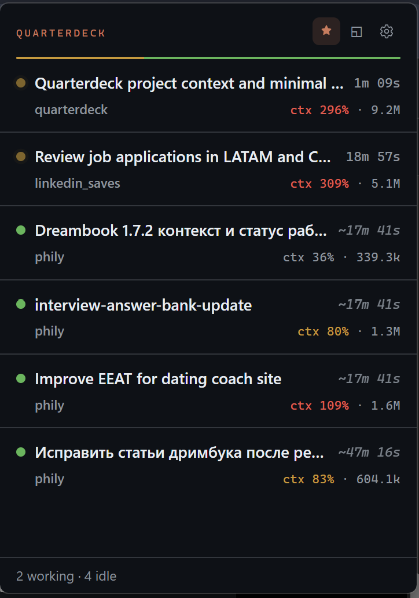
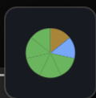
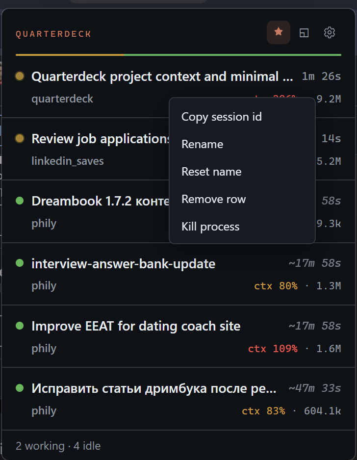
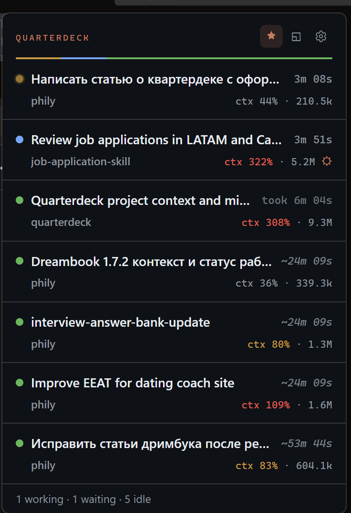
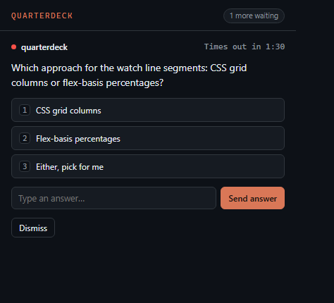

<div align="center">


# Quarterdeck

**The deck from which the captain commands the ship.**

*A tray app for Windows and macOS that watches every Claude Code session on your machine, and lets your agents reach back.*

[](LICENSE)
&nbsp;
&nbsp;
&nbsp;[](https://github.com/philippgross/quarterdeck/actions/workflows/ci.yml)

</div>

Run more than one Claude Code agent at once and you hit the same wall I did. Five terminals, five repos, and no answer to the only question that matters: which one needs me right now? You alt-tab through all of them, read the scrollback, and by the time you finish the loop the answer has changed. You have turned yourself into a human cron job polling your own agents.

Quarterdeck is the fix. It watches every Claude Code session on your machine, gives each one a live status you can read at a glance, and fires a native notification the second an agent finishes or gets blocked. That is the easy half, and a few other monitors do it too.

The half that matters: your agents can reach back. A running agent asks you a question through an always-on-top popup while it works, and your answer routes straight into that session. A twenty-minute autonomous run stops and asks "which of these two migrations?" instead of stalling or guessing wrong. That is the difference between a dashboard you stare at and a monitor you can actually be reached through.



## Why Quarterdeck

The other Claude Code trackers (hydropix/claude-deck, ClaudeDeck, and the rest, all Windows-only, all under a handful of stars) are read-only dashboards. They answer "what is each agent doing?" That is the cheap half. It is a faster version of the alt-tab loop, and it is worth having.

They do nothing about the expensive half: the agent that needs a decision only you can make. A dashboard shows you a session is blocked. It cannot carry your answer back. You still have to find the window and type into it. The information flows one way, agent to glass to your eyes, and the decision still has to make the return trip on foot.

Quarterdeck builds the return trip. An agent that can reach a human at the exact moment it is uncertain is worth far more than an agent that runs longer before it guesses. That reach-back channel, an [`ask_user` MCP tool](#agent-questions-ask-channel) wired to an always-on-top popup, is the whole point. Everything else is table stakes done well:

- **Live fleet view.** One popup lists every session: project, task title, status, and time-in-status, worst-first so what needs you floats to the top. The tray icon always shows the worst status across the fleet, so one glance tells you if anything is blocked without opening anything.
- **The watch line.** A thin segmented bar under the header shows the fleet's status mix, live: how many need you, are working, are waiting, or are idle.
- **Reach-back, both directions.** Agents ask you questions and send heads-up notifications through the local [MCP server](#agent-questions-ask-channel). Two-tier native toasts: a quiet one when a session finishes (quoting the model's actual last message), a distinct alert-styled one when a session is blocked on you.
- **Take over permission prompts.** When Claude Code is about to ask permission for a tool, Quarterdeck can show that prompt in its own popup: Allow, Deny, or fall back to the terminal. Fail-open by design, so it can never leave an agent stuck.
- **Quiet when you're already looking.** If the terminal running a session is the front window, Quarterdeck skips the toast and the popup for it. You are already watching; there is nothing to interrupt you with.
- **Real titles, honest timers.** Row titles come from Claude Code's own session registry, so a `/rename` updates within seconds. Sessions already running before Quarterdeck started get their timer seeded from the session's own data, marked with `~` until an exact hook event replaces it.
- **Move it, pin it, shrink it.** Drag the popup by its header, pin it open, or collapse it to a tiny traffic-light lamp: one status pie for the whole fleet, always on top and out of the way.
- **Everything local.** No account, no telemetry, no network call other than the `127.0.0.1` MCP endpoint your own agents talk to. See [Privacy](#privacy).

<table>
<tr>
<td width="50%" valign="top">
<br>
<sub><b>Lamp mode.</b> Pin the popup, then collapse it to a tiny traffic-light lamp: one pie of your fleet's status mix, always on top.</sub>
</td>
<td width="50%" valign="top">
<br>
<sub><b>Per-row actions.</b> Right-click any session to rename it, copy its id, drop the row, or kill the process.</sub>
</td>
</tr>
</table>

## How statuses work

Every session is in exactly one of five states, driven by Claude Code's own hook events, not by polling or parsing your transcripts.

| Status | Meaning | Enters when |
|---|---|---|
| 🟡 Working | Executing a turn | You submit a prompt, transcript activity resumes while blocked or idle, or an agent question gets answered |
| 🔵 Waiting | Own turn finished, but background subagents or a workflow are still running | The parent `Stop` fired while spawned subagents/workflows are still open (shown with a `⛭` multi-agent badge) |
| 🔴 Needs you | Blocked on a human | A permission prompt or elicitation dialog fires, or an agent is waiting on an `ask_user` question |
| 🟢 Idle | Turn finished, nothing running, awaiting instructions | Claude finishes responding, or a session starts |
| ⚪ Dead | Process is gone | A liveness check no longer finds the process |



A few details worth knowing:

- **Waiting is not idle.** A session whose turn ended but is still running subagents or a background workflow used to look falsely idle. Quarterdeck reads the live session registry and shows it as blue **Waiting** with a `⛭` multi-agent badge while the subagents run, so background work is never mistaken for done.
- **Recovery without a dedicated event.** Claude Code emits no hook when you grant a permission prompt in the terminal, so Quarterdeck watches the transcript file's size and mtime: once it advances after a "needs you" moment, the session flips back to working. No polling of the terminal, no parsing of message contents.
- **Dead rows fade, they don't vanish.** A session with no live process sticks around for 5 minutes in case it is a blip; a clean `SessionEnd` removes the row immediately.
- **Cold-start discovery.** On launch, Quarterdeck scans your recent transcripts and Claude Code's session registry for sessions it missed while it was not running, and flags them as inferred (`~`).

## Install

1. Download the installer for your platform from the [releases](https://github.com/philippgross/quarterdeck/releases) page, or build it yourself (see [Development](#development--build)):
   - Windows: `Quarterdeck_<version>_x64-setup.exe` (NSIS installer)
   - macOS: `Quarterdeck_<version>_<arch>.dmg`
2. Launch it. On first run Quarterdeck makes **no system changes until you say so**. It explains what it wants and asks explicitly:
   - **Install hooks**: required for sessions to show up at all (see below).
   - **Launch at login?**: explicit yes/no, off by default.
   - **Enable agent questions**: sets up the MCP tool so agents can reach you (see [Agent questions](#agent-questions-ask-channel)).

   You can run every one of these later from the gear icon → Settings.

### Installing hooks

Status tracking depends on Claude Code's hook events. "Install hooks" (first run, or Settings → "Install hooks" / "Repair hooks"):

- Adds `SessionStart`, `UserPromptSubmit`, `Notification`, `Stop`, `SubagentStart`, `SubagentStop`, and `SessionEnd` entries to your **user-level** `~/.claude/settings.json`, so they apply to every project. It deliberately does not hook `PreToolUse`/`PostToolUse`: no extra latency on the hot path.
- If "Take over permission prompts" is on (default), it also adds a `PermissionRequest` entry, toggled independently in Settings.
- Merges non-destructively: it never touches hooks it did not add, backs up your `settings.json` before the first write (latest 3 kept), and writes atomically so a crash mid-write cannot corrupt your config. If your `settings.json` does not parse, it stops and shows an error instead of overwriting anything.
- "Uninstall hooks" removes exactly the entries Quarterdeck added and leaves the rest untouched.

The hook scripts (`quarterdeck-hook.ps1` on Windows, `quarterdeck-hook.sh` on macOS) are copied into Quarterdeck's own data directory at install time, so the path Claude Code calls stays stable across updates. They write the hook's stdin JSON to Quarterdeck's spool directory and always exit `0`: a malformed payload is swallowed silently rather than breaking your session.

### Agent questions (ask channel)

This is the differentiator. "Enable agent questions" does two things, idempotently:

1. Registers Quarterdeck's local MCP server with the Claude CLI (if `claude` is on your `PATH`), equivalent to:

   ```
   claude mcp add --transport http --scope user quarterdeck http://127.0.0.1:<port>/mcp --header "Authorization: Bearer <token>"
   ```

   If the CLI is not found, Settings shows you this exact command with your real port and token filled in. The `<port>` is chosen once and persisted; the `<token>` is a generated bearer token, and requests without it are rejected.
2. Copies a bundled skill to `~/.claude/skills/quarterdeck/`, which teaches an agent *when* to ask (blocked on a human decision, about to do something risky or irreversible, facing an ambiguity it cannot resolve), when not to, and how to degrade gracefully if a question times out.

Once enabled, any Claude Code session on the machine can call:

- `ask_user(question, options?, detail?, context, timeout_seconds?)`: blocks on your answer. `detail` is optional longer rationale shown in muted type. Omit `timeout_seconds` (or pass `0`) for a persistent question that waits until answered. Returns `{answer, kind, ask_id}`, where `kind` is `option`, `text`, `form`, `timeout`, `dismissed`, `cancelled`, or `terminal`. Send a `questions` array instead of `question` for a multi-question / multi-select form.
- `update_ask(ask_id, ...)` / `cancel_ask(ask_id)`: revise or withdraw a still-pending question from a parallel tool call or a different session.
- `notify_user(message, context)`: fires a one-line, no-reply heads-up and returns immediately.

While a question is blocked, Quarterdeck keeps the MCP connection alive with a heartbeat so long or indefinite waits are not dropped by Claude Code's idle timeout. The bundled skill ([`skills/quarterdeck/SKILL.md`](skills/quarterdeck/SKILL.md)) documents the agent side in full.



## Development / build

Requirements: Node 20+, Rust (stable, MSVC toolchain on Windows), and on macOS the Xcode command line tools.

```bash
npm install         # UI + Tauri CLI deps
npm run dev         # tauri dev: live app with hot-reloading UI
npm run build       # tauri build: packaged installer (NSIS on Windows, dmg on macOS)
npm run ui:dev      # Vite dev server only (popup/ask UI in a browser, mocked IPC)
npm run ui:test     # UI test suite
```

Rust side, from the repo root:

```bash
cargo fmt --all -- --check
cargo clippy --workspace --all-targets --all-features -- -D warnings
cargo test --workspace
```

`crates/deck-core` is a pure-Rust library with no Tauri or GUI dependency: the engine, hook-config merging, naming, discovery, and liveness logic live there and are tested without a window. `src-tauri` is the thin OS-integration shell (tray, windows, notifications, MCP server) on top of it.

Useful environment variables for local testing (all optional): `QUARTERDECK_DATA_DIR` (override the data root), `QUARTERDECK_CLAUDE_DIR` (override the `~/.claude` directory), `QUARTERDECK_FAKE_NOTIFIER=1` (replace OS toasts with a JSONL trail for assertions), `QUARTERDECK_DEBUG=1` (verbose logging).

CI (`.github/workflows/ci.yml`) runs fmt, clippy, `cargo test`, the UI suite, and a full `tauri build` on both `windows-latest` and `macos-latest` on every push and pull request.

## Limitations

Quarterdeck is scoped tight. Not (yet) included:

- **Windows Terminal tab focus.** Click-to-focus was removed after it could hard-freeze the app; rows no longer jump to a terminal. Navigate by matching the row title, which mirrors the Claude Code tab name.
- **No per-subagent rows.** Background subagent activity shows as a count badge on its parent session's row, not as separate rows.
- **Windows and macOS only.** No Linux tray support.
- **No history or analytics.** Quarterdeck shows current state, not a log of past sessions.
- **No auto-update, unsigned builds.** Update by reinstalling; expect the usual first-run SmartScreen/Gatekeeper prompts.
- **English-only UI, fixed sounds.** No localization, and notification sounds are fixed system sounds (distinct per tier), not yet user-configurable.

## Privacy

Everything runs on your machine. No telemetry, no account, no outbound network call. The only network activity is the local MCP server bound to `127.0.0.1`, reachable only by your own Claude Code agents on this machine, and only with the generated bearer token. Session data (spool events, ask/answer history, settings) lives entirely under your local Quarterdeck data directory and is never sent anywhere.

## License

MIT, see [LICENSE](LICENSE). © Philipp Gross.
