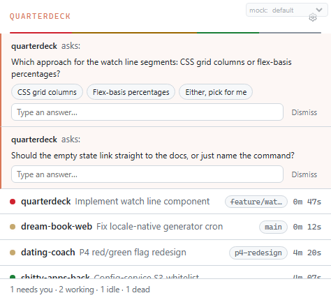

# Quarterdeck

**The deck from which the captain commands the ship.**

Quarterdeck is a Windows + macOS tray app that watches every **Claude Code**
session running on your machine, shows a live, glanceable status for each one,
fires a native notification when an agent finishes or needs you — and, unlike
every passive monitor out there, lets an agent **reach you back**: it can ask
you a question through an always-on-top popup while it works, and the answer
is routed straight back into that session.

Run several agents in parallel terminals and you already know the problem:
there's no answer to "who needs me right now?" without alt-tabbing through
every window. Quarterdeck puts that answer in your tray.


## Why Quarterdeck (the ask-channel differentiator)

Other Claude Code trackers (hydropix/claude-deck, ClaudeDeck, and similar,
all Windows-only, all under a handful of stars) are read-only dashboards:
they show you a status and stop there. Quarterdeck adds a channel *back* into
the conversation:

- A running agent calls the bundled `ask_user` MCP tool with a question
  (optionally with quick-pick options and a timeout).
- Quarterdeck pops an always-on-top window over whatever you're doing,
  without stealing keyboard focus, so it never interrupts what you're typing.
- Your answer — a button tap or free text — is written back and returned as
  the tool's result, and the agent continues.

That turns Quarterdeck from a dashboard you glance at into a monitor you can
actually be *reached through*: a long autonomous run can stop and ask "which
of these two approaches?" instead of guessing or stalling.

Beyond that, Quarterdeck is Windows **and** macOS (most alternatives are
Windows-only), status is driven by Claude Code's own hook events rather than
polling/parsing transcripts, and notifications are two-tier: a quiet "finished"
toast and a distinct, harder-to-miss "needs you" alert.

## Features

- **Live fleet view.** One popup lists every Claude Code session: project,
  task title, status, and time-in-status, sorted so what needs you floats to
  the top.
- **Tray status at a glance.** The tray icon shows the worst status across all
  sessions (needs-you beats working beats idle beats dead) — you don't even
  need to open the popup to know if everything's fine.
- **The watch line.** A thin segmented bar under the header shows the fleet's
  status mix (red/yellow/green/gray) proportionally, live — a one-glance read
  on how many sessions need you, are working, or are idle.
- **Native notifications, two tiers.** A standard toast when a session
  finishes ("*&lt;project&gt; finished* — waiting for new instructions"), and
  a distinct, alert-styled toast with its own sound when a session is blocked
  on you (permission prompt, elicitation dialog, or an agent question).
- **Agent questions (`ask_user` / `notify_user`).** A local MCP server lets an
  agent ask a blocking question (with options and a timeout) or send a
  fire-and-forget notice — see [Agent questions](#agent-questions-ask-channel)
  below.
- **Hook-driven precision.** Status comes from Claude Code's own `SessionStart`
  / `UserPromptSubmit` / `Notification` / `Stop` / `SessionEnd` hooks, not from
  polling or parsing transcript contents — cheap, accurate, and it recovers
  automatically once a permission prompt is answered in the terminal.
- **Cyrillic/Unicode safe.** Project paths and titles in any script render and
  round-trip correctly end to end.
- **Everything local.** No accounts, no telemetry, no network calls other than
  the `127.0.0.1` MCP endpoint your own agents talk to. See
  [Privacy](#privacy).



## Install

1. Download the installer for your platform from the
   [releases](https://github.com/philippgross/quarterdeck/releases) page (or
   build it yourself — see [Development](#development--build)):
   - Windows: `Quarterdeck_<version>_x64-setup.exe` (NSIS installer).
   - macOS: `Quarterdeck_<version>_<arch>.dmg`.
2. Launch Quarterdeck. On first run it shows a one-time onboarding card and
   makes **no system changes until you say so** — it explains what it wants
   to do and asks explicitly:
   - **Install hooks** — required for sessions to show up at all (see below).
   - **Launch at login?** — explicit yes/no, off by default.
   - **Enable agent questions** — sets up the MCP tool so agents can ask you
     things (see [Agent questions](#agent-questions-ask-channel)).

   You can run every one of these later from the gear icon → Settings.

### Installing hooks

Quarterdeck's status tracking depends on Claude Code's hook events. "Install
hooks" (first run, or Settings → "Install hooks" / "Repair hooks"):

- Adds `SessionStart`, `UserPromptSubmit`, `Notification`, `Stop`, and
  `SessionEnd` entries to your **user-level** `~/.claude/settings.json`, so
  they apply to every project on the machine. It deliberately does *not* hook
  `PreToolUse`/`PostToolUse` — no extra latency on the hot path.
- Never touches hooks it didn't add: it merges non-destructively, keeping any
  hooks you already have on those events, and only adds its own entries where
  none tagged `quarterdeck` already exist.
- Takes a timestamped backup of your `settings.json`
  (`settings.json.quarterdeck-backup-<timestamp>`, latest 3 kept) before the
  first write, and writes atomically (temp file + rename) so a crash mid-write
  can't corrupt your config.
- If your `settings.json` doesn't parse, it stops and shows an error instead
  of overwriting anything.
- "Uninstall hooks" removes exactly the entries Quarterdeck added and leaves
  everything else untouched.

The hook scripts themselves (`quarterdeck-hook.ps1` on Windows,
`quarterdeck-hook.sh` on macOS) are copied into Quarterdeck's own data
directory at install time, so the path Claude Code calls stays stable across
app updates. They read the hook's stdin JSON, write it to Quarterdeck's spool
directory, and always exit `0` — a malformed or unexpected hook payload is
swallowed silently rather than breaking your Claude Code session.

### Agent questions (ask channel)

"Enable agent questions" in Settings does two things, idempotently:

1. Registers Quarterdeck's local MCP server with the Claude CLI (if `claude`
   is on your `PATH`), equivalent to running:

   ```
   claude mcp add --transport http --scope user quarterdeck http://127.0.0.1:<port>/mcp --header "Authorization: Bearer <token>"
   ```

   If the CLI isn't found, Settings shows you this exact command (with your
   real port and token filled in) to run yourself. `<port>` is chosen once and
   persisted; `<token>` is a generated bearer token — requests to the MCP
   server without it are rejected.
2. Copies the bundled skill to `~/.claude/skills/quarterdeck/`, which teaches
   an agent *when* it's appropriate to ask (blocked on a human decision, about
   to do something risky/irreversible, or facing an ambiguity it can't resolve
   itself) and when not to (anything it can reasonably decide on its own) —
   and to degrade gracefully (proceed on its best judgment, and say so) if a
   question times out or is dismissed.

"Disable agent questions" reverses both. Once enabled, any Claude Code session
on the machine can call `ask_user(question, options?, context, timeout_seconds?)`
to block on your answer, or `notify_user(message, context)` to fire off a
one-line, no-reply heads-up.


## How statuses work

Every session shown in Quarterdeck is in exactly one of four states, driven
by Claude Code's own hook events (not by polling or parsing your transcripts):

| Status | Meaning | Enters when |
|---|---|---|
| 🟡 Working | Executing a turn | You submit a prompt, or transcript activity resumes while blocked/idle, or an agent question gets answered |
| 🔴 Needs you | Blocked on a human | A permission prompt / elicitation dialog notification fires, or an agent is waiting on an `ask_user` question |
| 🟢 Idle | Turn finished, awaiting instructions | Claude finishes responding, or a session starts |
| ⚪ Dead | Process is gone | A liveness check fails to find the process anymore |

A few details worth knowing:

- **Recovery without a dedicated event.** Claude Code doesn't emit a hook when
  you grant a permission prompt in the terminal, so Quarterdeck watches the
  transcript file's size/mtime: once it advances after a "needs you" moment,
  the session flips back to "working" — no polling of the terminal, no
  parsing of message contents.
- **Dead rows fade, they don't vanish instantly.** A session with no live
  process sticks around for 5 minutes (in case it's a blip) before being
  removed; a clean `SessionEnd` removes the row immediately regardless.
- **Cold-start discovery.** On launch, Quarterdeck also scans your recent
  `~/.claude/projects/*/*.jsonl` transcripts (last 6 hours) for sessions it
  missed while it wasn't running, and shows them flagged as inferred (`~`) —
  best-effort, since it has no live process to track for those.
- **The tray icon is always the worst status across your fleet** — one
  session needing you turns the whole tray icon red, so you never have to
  open the popup just to check.

## Development / build

Requirements: Node 20+, Rust (stable, MSVC toolchain on Windows), and on
macOS the Xcode command line tools (for signing-free local builds).

```bash
npm install                 # installs UI + Tauri CLI deps
npm run dev                 # tauri dev — live app with hot-reloading UI
npm run build                # tauri build — packaged installer (NSIS on Windows, dmg on macOS)
npm run ui:dev               # Vite dev server only (popup/ask UI in a browser, mocked IPC)
npm run ui:build             # production UI bundle (ui/dist)
npm run ui:test              # UI test suite
npm run gen-icons            # regenerate tray/app icons from scratch
```

Rust-side, from the repo root:

```bash
cargo fmt --all -- --check
cargo clippy --workspace --all-targets --all-features -- -D warnings
cargo test --workspace
```

`crates/deck-core` is a pure-Rust library with no Tauri/GUI dependency — the
engine, hook-config merging, naming, discovery, and liveness logic all live
there and are unit/integration tested without needing a window. `src-tauri`
is the thin OS-integration shell (tray, windows, notifications, the MCP
server) on top of it.

Useful environment variables for local testing (all optional):

- `QUARTERDECK_DATA_DIR` — override the data root (default: `%APPDATA%/quarterdeck`
  on Windows, `~/Library/Application Support/quarterdeck` on macOS).
- `QUARTERDECK_CLAUDE_DIR` — override the `~/.claude` directory used for hook
  install and cold-start discovery.
- `QUARTERDECK_FAKE_NOTIFIER=1` — replace real OS toasts with a JSONL trail
  at `<data>/notifier-calls.jsonl`, for scripted assertions.
- `QUARTERDECK_DEBUG=1` — verbose logging.

CI (`.github/workflows/ci.yml`) runs `cargo fmt --check`, `cargo clippy -D
warnings`, `cargo test`, the UI test suite, and a full `tauri build` on both
`windows-latest` and `macos-latest`, uploading the resulting installer/bundle
as a build artifact on every push and pull request.

## Limitations (v1)

Quarterdeck v1 is intentionally scoped tight. Not (yet) included:

- **No click-to-focus terminal.** Clicking a row or a notification opens the
  Quarterdeck popup, not the terminal window running that session — Claude
  Code hooks don't expose enough to reliably locate and focus the right
  terminal tab/pane across every terminal app. Deferred to v2.
- **No per-tab / subagent rows.** Only top-level sessions are tracked; the
  fleet view doesn't break out subagents individually.
- **Windows and macOS only.** No Linux tray support in v1.
- **No history or analytics.** Quarterdeck shows current state, not a log of
  past sessions.
- **No auto-update.** Update by downloading and reinstalling.
- **Unsigned builds.** Installers aren't code-signed/notarized yet — expect
  the usual first-run SmartScreen/Gatekeeper prompts.
- **English-only UI.** No localization in v1.
- **No sound customization.** Notification sounds are fixed system sounds,
  distinct per notification tier, not user-configurable yet.

## Privacy

Everything Quarterdeck does runs on your machine. There is no telemetry, no
account, and no outbound network call — the only network activity is the
local MCP server bound to `127.0.0.1`, which only your own Claude Code agents
on this machine can reach (and only with the generated bearer token). Session
data (spool events, ask/answer history, settings) lives entirely under your
local Quarterdeck data directory and is never sent anywhere.

## License

MIT — see [LICENSE](LICENSE). © Philipp Gross.
